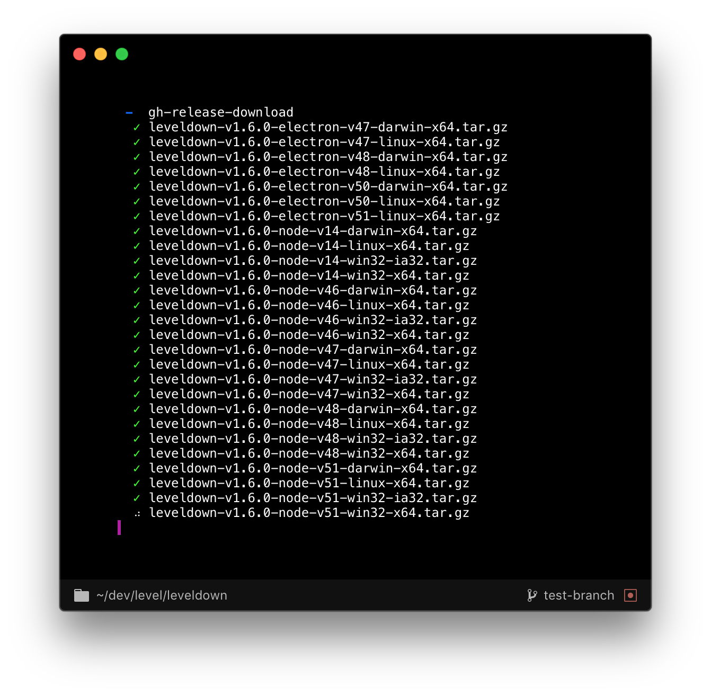

# gh-release-download

Download all assets of a GitHub release.



## Example

Using the API:

```js
const download = require('gh-release-download')

// point to your local checkout of a repository

const downloader = download({
  dir: process.env.HOME + '/dev/level/leveldown'
})

downloader.events.on('start', name => console.log(`${name}...`))
downloader.events.on('finish', name => console.log(name))

downloader
.then(() => console.log('All downloaded'))
.catch(err => console.error(err))
```

Using the CLI:

```bash
$ cd ~/dev/Level/leveldown
$ gh-release-download
...
$ ls dist/
...
```

## Installation

For API:

```bash
$ npm install gh-release-download
```

For CLI:

```bash
$ npm install -g gh-release-download
```

## License

MIT
